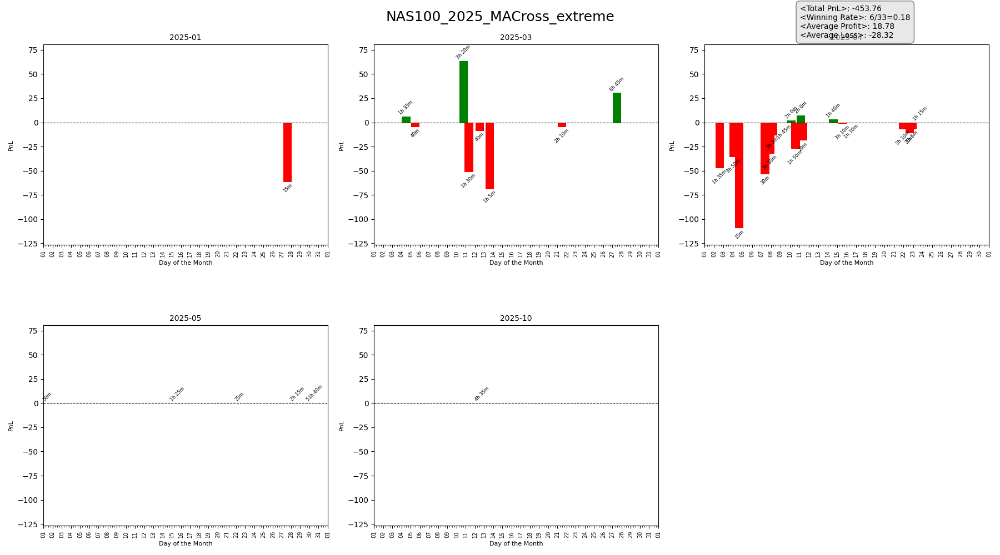

# Backtesting Engine

A Python portfolio backtesting engine for trading strategies across indices, FX, and crypto. Supports multi-strategy portfolios with parallel execution, shared/independent capital modes, realistic trading costs (slippage + commission), and comprehensive performance reporting.



## Features

- **Multi-strategy portfolio** — run multiple strategies with independent or shared capital
- **Parallel execution** — strategies run concurrently via `ProcessPoolExecutor` with shared memory
- **Realistic cost modeling** — configurable slippage and commission on entry/exit
- **Signal delay** — buffer signals N bars to prevent look-ahead bias
- **Partial exits** — close a fraction of a position and scale down the remainder
- **Multi-timeframe safe** — ffilled bars from timeline unification are detected and skipped during signal logic
- **Tradable-bar awareness** — market rest periods, last candles, and gap opens are flagged and respected
- **Vectorized position math** — all position operations use numpy arrays, no Python loops per position

## Quick Start

```bash
# 1. Clone and install
git clone https://github.com/YOUR_USERNAME/backtesting-engine.git
cd backtesting-engine
pip install -r requirements.txt

# 2. Add price data
#    Place CSV files in DB/{source}/{timeframe}/{ticker}.csv
#    Example: DB/FXCM/M5/NAS100.csv
#    Format: Date,BidOpen,BidHigh,BidLow,BidClose,AskOpen,AskHigh,AskLow,AskClose,Volume,Timestamp

# 3. Run the example
python examples/run_backtest.py
```

```python
# Or use as a library
from engine.backtester import portfolioBacktester, save_file
from plotting.charts import bar_monthly

backtester = portfolioBacktester('config/example_macross.json')
backtester.load_strategies()
memory_manager = backtester.run_backtest()
results = backtester.compile_results(memory_manager)

save_file(results, 'MyBacktest', 'output')
bar_monthly(results['port_trade_log'], fig_name="MyBacktest", save_plot=True)
```

## System Architecture

```
  JSON Config ──> portfolioBacktester (Orchestrator)
                    |
          ┌─────────┼──────────┐
          v         v          v
    Strategy     ProcessPool   Result
    Loader       Executor      Compiler
    (Thread)     (parallel)    (Thread)
          |         |          |
          v         v          v
    Strategy   StrategyProcessor   DataFrames
    Classes    per-bar loop:       + trade logs
               1. update_signal()
               2. suppress ffilled bars
               3. signal delay
               4. position actions
               5. entry/hold/exit
               6. portfolio update
                    |
                    v
              PositionManager          SharedMemoryManager
              (vectorized numpy)       (cross-process state)
```

### Data Flow

```
Historical CSVs (DB/)
      │
      v
data/loader.py              Load CSV, timezone convert (UTC → US/Eastern)
      │
      v
data/time_utils.py           Generate tradable-time grid per instrument type
      │
      v
data/preprocessing.py        Align prices to grid (ffill gaps → tradable=2)
                             Prefix columns by direction (Long_*, Short_*)
                             Mark market-open gaps (tradable=3)
      │
      v
Strategy.prepare_backtest_data()    Compute indicators & pre-generate signals
      │
      v
_create_unified_timeline()   Merge all strategy timelines, mark _is_filled
      │
      v
StrategyProcessor            Bar-by-bar simulation with ffill protection
      │
      v
compile_results()            Build output DataFrames + trade logs
```

## Configuration

Backtests are driven by JSON config files. See `config/example_macross.json` for a fully annotated example.

### Backtest Settings

| Field | Type | Description |
|---|---|---|
| `initialCash` | float | Starting capital |
| `shared_principal` | string | `"True"`: strategies share one capital pool. `"False"`: each gets `initialCash * weight` |
| `delay` | int | Signal delay in bars (0 = immediate execution) |
| `limit_position_size_type` | string | `"equity"` or `"margin"` — how available cash is calculated |
| `slippage_pct` | float | Slippage as fraction of price (e.g. `0.0001` = 1 bps) |
| `commission_pct` | float | Commission as fraction of round-trip notional |

### Strategy Parameters

Each entry in `strategyInfo` requires:

| Field | Description |
|---|---|
| `strategy` | Class name (must exist in `strategies/strategies_object.py`) |
| `Tickers` | Instrument name matching CSV filename in `DB/` |
| `timeframe` | Bar period: `"M5"`, `"H1"`, `"1D"`, etc. |
| `leverage` | Position leverage multiplier |
| `position_directions` | Direction labels, e.g. `["Long", "Short"]` — controls matrix columns |
| `max_DirectionsPosition` | Max concurrent positions per direction, e.g. `[1, 1]` — controls matrix rows |
| `position_weights` | Capital allocation per direction, e.g. `[1, 1]` |
| `weight` | Portfolio-level capital weight |
| `id` | Unique strategy identifier |
| `data_source` | Data provider subfolder in `DB/`, e.g. `"FXCM"` |

Additional strategy-specific parameters (MA periods, ATR multipliers, etc.) are passed directly to the strategy constructor via `**kwargs`.

## Project Structure

```
backtesting-engine/
├── engine/                     Core backtesting engine
│   ├── backtester.py           portfolioBacktester orchestrator
│   ├── strategy_processor.py   Per-strategy bar-by-bar loop + ffill guard
│   ├── position_manager.py     PositionManager + MarginCalculator
│   ├── records.py              BacktestRecord_temp / _strat / _port
│   ├── shared_memory.py        Cross-process shared arrays
│   └── task_manager.py         TaskQueue + memory cleanup managers
│
├── data/                       Data loading & preprocessing
│   ├── loader.py               CSV reading + timezone conversion
│   ├── preprocessing.py        Price alignment, anomaly check, tradable flags
│   └── time_utils.py           Trading hours masks by instrument type
│
├── strategies/                 Trading strategy implementations
│   ├── strategies_object.py    Strategy class registry
│   ├── base.py                 StrategyBase with shared data pipeline
│   ├── tools.py                Helper functions (find_first_, backtest_prepare)
│   └── examples/
│       ├── ma_cross.py         Moving Average Crossover with adaptive exits
│       └── directional_change.py   Directional Change trend detection
│
├── plotting/                   Visualization
│   └── charts.py               Monthly PnL bars, equity curves, event windows
│
├── config/
│   └── example_macross.json    Annotated example configuration
│
├── examples/
│   └── run_backtest.py         Working example script
│
├── samples/                    Sample outputs (lightweight, committed)
│   ├── monthly_pnl_example.png
│   └── trade_log_example.csv
│
├── DB/                         Price data (gitignored)
│   └── {source}/{timeframe}/{ticker}.csv
│
├── output/                     Generated results (gitignored)
└── plots/                      Generated charts (gitignored)
```

## Included Strategies

### MACross — Moving Average Crossover

Entry on MA crossover with three phases of filters:

1. **Entry quality** — slope confirmation, efficiency threshold, instability filter, extreme range suppression
2. **Adaptive exits** — ATR-based initial stop loss, trailing stop with activation threshold, ATR take-profit, max holding time
3. **Session filters** — optional time-of-day and minimum ATR regime filters

### Directional_Change2 — Directional Change

Identifies trend reversals using the Directional Change framework. Entry when cumulative price change from a reference point exceeds a fixed threshold. Exit on theta take-profit, time-based (2t) exit, or DC-based stop loss reversal.

## Temp Matrices Design

The core of the engine is `BacktestRecord_temp` — 2D numpy arrays of shape `(max_positions, num_directions)`:

- **Columns** = trading directions (e.g. `["Long", "Short"]`)
- **Rows** = concurrent position slots (e.g. `max_DirectionsPosition = [3, 2]` → 3 rows)

All position operations (`process_entries`, `process_holdings`, `process_exits`) are vectorized across the full matrix in one call — no Python loops over individual positions.

```
Example: Simple trend strategy (1 Long + 1 Short)
  position_directions = ["Long", "Short"]
  max_DirectionsPosition = [1, 1]

              Long    Short
  slot 0  [  True  ,  False  ]    entry_signal
  slot 0  [ 18500  ,   0.0   ]    trade_entry_price
```

## Tradable Bar Labels

| Value | Meaning | Engine behavior |
|-------|---------|-----------------|
| `1` | Tradable | Full signal logic runs |
| `0` | Rest period / last candle | Entry suppressed |
| `2` | Forward-filled (gap in data) | Entry suppressed |
| `3` | Market-open gap | Entry suppressed |
| `4` | Statistics lookback period | Entry suppressed |
| `_is_filled=True` | Unified timeline ffill | Full `update_signal()` skipped, only prices passthrough |

## Trading Cost Model

**Slippage** adjusts fill prices:
- Long entry: `price * (1 + slippage_pct)` — pay more
- Long exit: `price * (1 - slippage_pct)` — receive less
- Short: reversed

**Commission** on round-trip notional:
```
commission = (entry_notional + exit_notional) * commission_pct
realized_pnl = raw_pnl - commission
```

## Trade Log Columns

| Column | Description |
|---|---|
| `Start Date` | Entry timestamp |
| `End Date` | Exit timestamp |
| `Position Direction` | `"Long"` or `"Short"` |
| `PnL` | Realized profit/loss (after commission) |
| `PnL ratio` | PnL / initial position value |
| `Holding Time` | Bars held |
| `Entry Price` | Fill price at entry (after slippage) |
| `Exit Price` | Fill price at exit (after slippage) |
| `Leverage` | Position leverage |
| `Position Size` | Units |
| `Exit Type` | Strategy-defined exit reason |
| `Past Trade` | Strategy-defined trade metadata |
| `Commission` | Total commission charged |
| `Close Type` | `"full"` or `"partial"` |

## CSV Data Format

Place price data in `DB/{source}/{timeframe}/{ticker}.csv`:

```csv
Date,BidOpen,BidHigh,BidLow,BidClose,AskOpen,AskHigh,AskLow,AskClose,Volume,Timestamp
2024-01-02 18:00:00,16800.5,16815.2,16798.1,16810.3,16801.5,16816.2,16799.1,16811.3,1250,1704232800
```

Timestamps are assumed UTC and converted to US/Eastern internally.

## Dependencies

- Python >= 3.10
- pandas >= 2.0
- numpy >= 1.24
- matplotlib >= 3.7

## License

MIT
